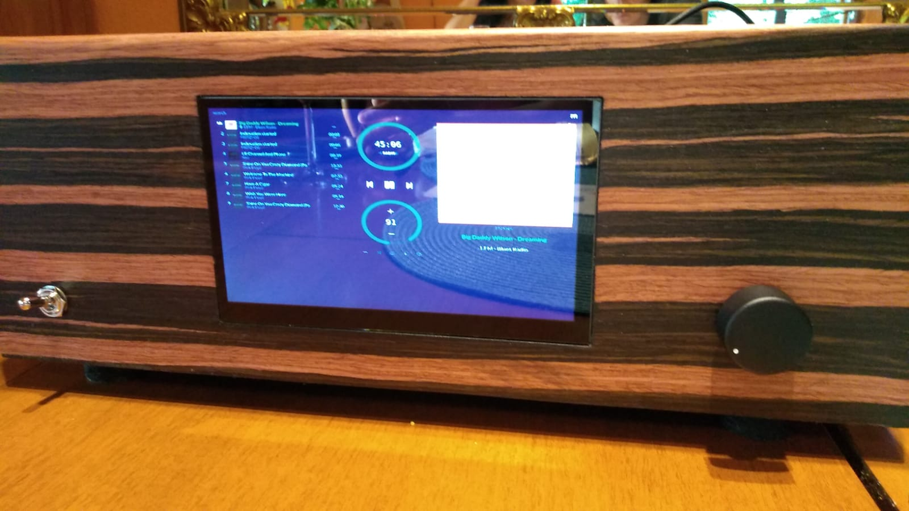

# SymAsym
**HiFi Verstärker**

Verbaut in einem DIY-Gehäuse mit Raspberry PI + Hifiberry DAC+.  Aktuell im Pi4 mit fetter passiver Kühlung.

Es gibt verschiedene Anbieter von Platinen, die man "nur" noch bestücken muss.  
Bei der von mir gewählten Platine bereits die Anti-Plopp-Schaltung integriert. Die schützt aber nur vor dem Ein-und Ausschalt-Plopp. Sollten im Fehlerfall, z. B. ein Defekt das Transistors Q1) mit im laufenden Betrieb geschlossenen Relais, die Endstufentransistoren voll aufmachen, dann liegen an dem Lautsprecher >30 V an, was diesen tötet.  
Daher MUSS eine DC-Erkennung eingebaut werden, die Gleichspannung am Lautsprecher erkennt und die Verbindung unterbricht!  
  
https://www.amazon.de/gp/product/B092HYNDGN/ref=ppx_od_dt_b_asin_title_s00?ie=UTF8&psc=1  
16 €  

Die Kühlkörper (siehe unten, 150mm x 70mm x 25mm), die ich verbaut habe, erwärmen sich im Zimmerlautstärke-Betrieb auf ca. 46 Grad C. Bei de Lautstärke, bei der man die Fenster schließt, um die Nachbarn nicht zu nerven, aber für meinen Begriff noch nicht extrem laut, werden die KK ca. 60 Grad C heiß.

Platinen:  
2 x https://www.atogmbh-shop.de/p/platine-fuer-btc-amplifier-nach-symasym-v5-3 
*Es handelt sich bei dem Plan von Ato-GmbH um die Variante "Betrieb ohne Vorverstärker" (R30=499 Ohm, R16=R19=0 Ohm, siehe auch http://anleitung.diy-audio-shop.de/Symasym.pdf ), die aber bei Bedarf leicht modifizierbar ist*  
20 € + 5 € Versand  

Bauteile:  
https://www.reichelt.de/my/1833715  
2 x Gleichricher:  
B140C10A  
https://www.reichelt.de/brueckengleichrichter-200-v-10-a-b140c10a-p4664.html?&trstct=pol_2&nbc=1  
Ca. 70 € 

Kühlkörper:  
2 x https://www.atogmbh-shop.de/p/kuehlkoerper-fuer-btc-amplifier-nach-symasym-v5-3  
12 € + 5 € Versand  
Nachtrag: die Kühlkörper sind zu klein. Besser die SK 85/75/SA nehmen für
2 x 12,4 €  

2 Lastwiderstände von Bürklin:  
BestNr: 36E4790 (MPC722 0R22+0R22 K)  
Typ: FUTABA MPC722 2X0R22 K  
3,20 € + 8,50 € Versand!  

Transformatoren:  
2 x https://sklep.toroidy.pl/en_US/p/TTSA0200-Transformer-AUDIO-TSA200VA-voltage-to-50V-/315  
122 €  
Ein Trafo reicht völlig!

Gehäuse: 
Selbstbau aus Holz.   
10 €

Gitter als Deckel:  
5 €

Stereo-Poti, 22k/log:  
5 €  
Besser Alps RK27 https://www.reichelt.de/drehpotentiometer-stereo-50-kohm-logarithmisch-6-mm-rk27112-log50k-p73834.html?&nbc=1:  
ca. 17 €  

Kaltgerätebuchse für Gehäuse:  
4,49 €

4 Buchsen für die Lautsprecher: 
https://www.amazon.de/dp/B01M97RNNE/ref=sspa_dk_hqp_detail_aax_0?psc=1&spLa=ZW5jcnlwdGVkUXVhbGlmaWVyPUEzQzI2VjdYWFI4N01UJmVuY3J5cHRlZElkPUEwNzE2NDg2M09EVDZTN1FQUTNFRCZlbmNyeXB0ZWRBZElkPUEwNDQwMzkzMkhJWlRER1AxMFpaOCZ3aWRnZXROYW1lPXNwX2hxcF9zaGFyZWQmYWN0aW9uPWNsaWNrUmVkaXJlY3QmZG9Ob3RMb2dDbGljaz10cnVl  
13,5 €

Plus Raspberry Pi mit 7" Touchdisplay:
https://www.amazon.de/gp/product/B08VNPYQ7Y/ref=ppx_yo_dt_b_search_asin_title?ie=UTF8&psc=1

Es ist vollbracht und ja, es hat sich gelohnt!  

HifiberryOS hat sich bei mir als "out of the box" stabil erwiesen. Moode vergisst nach einiger Zeit reproduzierbar den Hifiberry DAC+, Volumino kommt mit dem Display nicht gut zurecht.

Update Juni 22:  
Zwischenzeitlich hat HifiberryOS sich nicht mehr mit Spotify vertragen. Bin wieder bei Moode und nun sehr damit zufrieden.  

Update Oktober 23:
Wieder bei HifiberryOS, Moode hatte immer wieder Verbindungsabbrüche. HifiberryOS klappt nun "out of the Box".

Update Mai 24:  
Es ist ein Drama, Spotify connect funktioniert mehr sehr schlecht als recht. Auch die neueste Alpha unter Pi4 ist hinsichtlich Spoify unbrauchbar. Gebe nun wieder Moode eine Chance. Wäre schön, wenn das mal langfristig funktionieren würde.  
Und - der Sound ist soooo geil!

Konfiguration PI3:  
In confix.txt eintragen für Shutdown via Taster  
dtoverlay=gpio-shutdown,gpio_pin=3,active_low=1,gpio_pull=up  
Das funktioniert mit jedenfalls mit Moode aber nicht mit HifiBerryOS egal welcher GPIO_pin verwendet wird, siehe https://www.hifiberry.com/blog/powering-up-down-your-pi-with-a-button/

Konfiguration PI3:  
Keine Einstellungen notwendig
